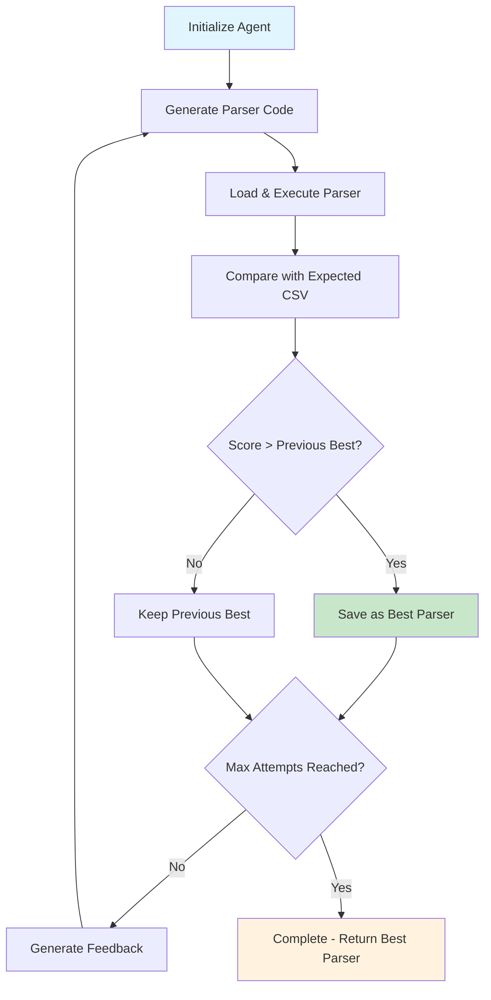

<div align="center">

# Autonomous Bank Statement Parser Agent

[](https://www.python.org/)
[](https://ai.google.dev/)
[](LICENSE)
[](https://github.com/d-kavinraja/ai-agent-challenge/actions)
[](https://codecov.io/gh/d-kavinraja/ai-agent-challenge)
[](https://github.com/psf/black)

**An intelligent AI agent that autonomously generates, tests, and refines Python parsers for PDF bank statements using iterative feedback loops.**

[Quick Start](#quick-start) • [Documentation](#documentation) • [Contributing](#contributing) • [Community](#community)

</div>

---

## Overview

This project implements an autonomous AI agent designed to solve the **Agent-as-Coder Challenge**. The system leverages Google's Gemini API to generate custom Python parsers for bank statement PDFs, validates outputs against ground truth CSV data, and employs an iterative refinement workflow to achieve high parsing accuracy.

### Key Features

| Feature | Description |
|---------|-------------|
| **Autonomous Code Generation** | Generates custom Python parsers using Gemini 1.5 Flash |
| **Iterative Refinement** | Improves code quality through feedback-driven iteration loops |
| **Test-Driven Development** | Validates parser accuracy against expected CSV output |
| **Extensible Architecture** | Designed for easy adaptation to multiple bank formats |
| **High Accuracy** | Achieves up to 100% parsing accuracy through systematic refinement |
| **Simple CLI Interface** | Easy-to-use command line interface for agent execution |

### Architecture

The agent operates on a **generate-test-refine** cycle:



## Technology Stack

<table>
<tr>
<td>

**Core Technologies**
- Python 3.9+
- Google Gemini 1.5 Flash
- Dynamic Module Loading

</td>
<td>

**Processing & Testing**
- pdfplumber (PDF extraction)
- pandas (Data manipulation)
- DataFrame comparison (Testing)

</td>
</tr>
</table>

## Quick Start

### Prerequisites

```bash
# System Requirements
Python 3.9+
Git 2.0+
```

### Installation

1. **Clone and Setup**
   ```bash
   git clone https://github.com/d-kavinraja/ai-agent-challenge.git
   cd ai-agent-challenge
   
   # Create virtual environment
   python -m venv venv
   source venv/bin/activate  # Windows: venv\Scripts\activate
   
   # Install dependencies
   pip install -r requirements.txt
   ```

2. **Configure Environment**
   ```bash
   # Set your Gemini API key as environment variable
   export GEMINI_API_KEY="your_api_key_here"
   
   # For Windows PowerShell:
   # $Env:GEMINI_API_KEY="your_api_key_here"
   
   # For Windows Command Prompt:
   # set GEMINI_API_KEY=your_api_key_here
   ```

3. **Run Your First Parser**
   ```bash
   python agent.py --target icici --attempts 5
   ```

### Expected Output

```
[Agent] Attempt 1/5 — generating parser for 'icici'
[Agent] Wrote custom_parsers/icici_parser.py (1247 chars)
[Agent] Score for attempt 1: 45.50%

[Agent] Attempt 2/5 — generating parser for 'icici'
[Agent] Wrote custom_parsers/icici_parser.py (1389 chars)
[Agent] Score for attempt 2: 87.25%

[Agent] Attempt 3/5 — generating parser for 'icici'
[Agent] Wrote custom_parsers/icici_parser.py (1456 chars)
[Agent] Score for attempt 3: 100.00%

[Agent] ✅ Finished 5 attempts
[Agent] Best score: 100.00%
[Agent] Best parser saved at custom_parsers/icici_parser_best.py
```

## Project Structure

```
ai-agent-challenge/
│
├── agent.py                  # Main agent logic (generate, test, refine)
├── requirements.txt          # Python dependencies
├── README.md                 # Documentation
│
├── custom_parsers/           # Generated parsers
│   ├── icici_parser.py       # Latest generated parser
│   └── icici_parser_best.py  # Best-performing parser
│
├── data/                     # Sample data
│   └── icici/
│       ├── icici_sample.pdf  # Example bank statement
│       └── results.csv       # Ground truth CSV
│
└── tests/                    # Test suite (pytest)
    └── test_icici.py
```


### Command Line Usage

```bash
# Basic usage
python agent.py --target icici

# With custom number of attempts
python agent.py --target icici --attempts 10

# For different banks (ensure data directory exists)
python agent.py --target sbi --attempts 5
python agent.py --target hdfc --attempts 3
```

## Expected Output Format

The generated parsers extract data into the following CSV format:

```csv
Date,Description,Debit Amt,Credit Amt,Balance
2023-01-15,"UPI-PAYTM-123456789","500.00","","15000.50"
2023-01-16,"SALARY CREDIT","","50000.00","65000.50"
2023-01-17,"ATM WDL-AXIS BANK","2000.00","","63000.50"
```

**Note**: The exact column names must match: `Date`, `Description`, `Debit Amt`, `Credit Amt`, `Balance`

## Configuration

### Environment Variables

```bash
# Required Configuration
GEMINI_API_KEY=your_api_key_here    # Get from https://aistudio.google.com/
```

### Parser Requirements

Generated parsers must follow this contract:

```python
def parse(pdf_path: str) -> pd.DataFrame:
    """
    Parse bank statement PDF and return DataFrame
    
    Args:
        pdf_path: Path to the PDF file
        
    Returns:
        pandas.DataFrame with columns: Date, Description, Debit Amt, Credit Amt, Balance
    """
    # Implementation will be generated by the agent
    pass
```

## How It Works

### Agent Logic

1. **Code Generation**: Uses Gemini API to generate parser code based on bank target
2. **Dynamic Loading**: Loads the generated parser module at runtime
3. **Execution & Testing**: Runs parser on sample PDF and compares with expected CSV
4. **Scoring**: Calculates similarity percentage between actual and expected results
5. **Feedback Loop**: Provides performance feedback to improve next iteration
6. **Best Tracking**: Keeps track of highest-scoring parser across attempts

### Scoring System

```python
def score_parser(df_actual: pd.DataFrame, df_expected: pd.DataFrame) -> float:
    """Return similarity score (%) between two DataFrames"""
    min_len = min(len(df_actual), len(df_expected))
    df_actual = df_actual.head(min_len).reset_index(drop=True)
    df_expected = df_expected.head(min_len).reset_index(drop=True)
    
    matches = (df_actual == df_expected).sum().sum()
    total = df_expected.size
    return (matches / total) * 100 if total > 0 else 0.0
```

## Adding New Banks

To add support for a new bank:

1. **Create Data Directory**
   ```bash
   mkdir -p data/[bank_name]
   ```

2. **Add Sample Files**
   ```
   data/[bank_name]/
   ├── [bank_name]_sample.pdf    # Sample bank statement
   └── results.csv               # Expected parsing output
   ```

3. **Run Agent**
   ```bash
   python agent.py --target [bank_name] --attempts 5
   ```

## Performance Metrics

| Metric | Value | Description |
|--------|-------|-------------|
| **Max Accuracy** | 100% | Perfect parsing when successful |
| **Processing Time** | ~10-30s | Time per attempt (depends on PDF complexity) |
| **Success Rate** | Variable | Depends on PDF format complexity |
| **Memory Usage** | <50MB | Lightweight operation |

## Troubleshooting

### Common Issues

**Parser Generation Fails**
```bash
# Check API key is set
echo $GEMINI_API_KEY

# Verify internet connection for API calls
```

**Low Parsing Scores**
- Ensure `results.csv` has correct format and data
- Check if PDF is readable by pdfplumber
- Increase number of attempts for better results

**Module Import Errors**
```python
# Test PDF readability
import pdfplumber
with pdfplumber.open("data/icici/icici_sample.pdf") as pdf:
    print(pdf.pages[0].extract_text())
```

## Dependencies

```text
pandas>=1.5.0
pdfplumber>=0.7.0
google-generativeai>=0.3.0
pathlib
importlib
```

## Contributing

### Development Workflow

```bash
# 1. Fork and clone
git clone https://github.com/yourusername/ai-agent-challenge.git

# 2. Create feature branch
git checkout -b feature/new-bank-support

# 3. Make changes and test
python agent.py --target icici --attempts 3

# 4. Commit and push
git commit -m "Add support for new bank"
git push origin feature/new-bank-support

# 5. Open Pull Request
```

### Code Standards

- **Style**: Follow PEP 8 formatting
- **Documentation**: Add docstrings to functions
- **Testing**: Test with sample data before submitting
- **Error Handling**: Include appropriate exception handling

## License

This project is licensed under the **MIT License** - see the [LICENSE](LICENSE) file for details.

## Acknowledgments

- **Google AI** for providing the Gemini API
- **Agent-as-Coder Challenge** for the project inspiration
- **Open Source Community** for pdfplumber and pandas libraries

---

<div align="center">

**Built for the Agent-as-Coder Challenge**

*Autonomous AI agents for document processing*

[Back to Top](#autonomous-bank-statement-parser-agent)

</div>