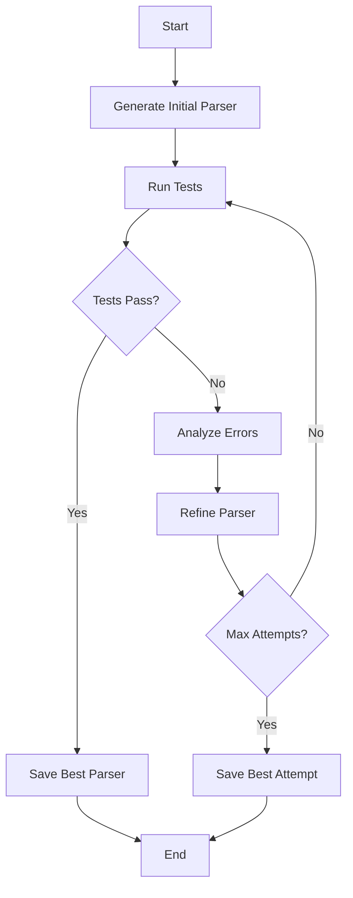

# 🤖 AI Agent Challenge – Bank Statement Parser

## 📌 Overview

This project is a solution for the **Agent-as-Coder Challenge** 🎯. The primary goal is to build an autonomous AI agent capable of writing, testing, and refining custom Python parsers for bank statement PDFs.

The agent leverages a feedback-driven loop to improve its code generation iteratively. It uses the **Gemini API** for code synthesis, analyzes test results from **pytest** for correctness, and uses a workflow inspired by **LangGraph** to manage the retry and refinement logic. This implementation focuses on parsing ICICI bank statements into a structured CSV format.

## 📂 Project Structure

Here is a map of the repository to help you navigate the codebase:

```
ai-agent-challenge/
│
├── agent.py                 # Main agent workflow logic
├── run_parser_tests.py      # Script to run pytest on generated parsers
├── requirements.txt         # Project dependencies
├── README.md                # You are here!
│
├── custom_parsers/          # Directory for auto-generated parser files
│   ├── icici_parser.py      # The latest generated parser
│   └── icici_parser_best.py # The best-performing parser
│
├── data/
│   └── icici/
│       ├── icici_sample.pdf # An example input bank statement
│       └── results.csv      # The ground truth for expected output
│
└── tests/
    └── test_icici.py        # Pytest validation test cases
```

## ⚙️ Setup and Installation

Follow these steps to get the project running on your local machine.

### 1️⃣ Clone the Repository

First, clone the project from GitHub:

```bash
git clone https://github.com/d-kavinraja/ai-agent-challenge.git
cd ai-agent-challenge
```

### 2️⃣ Create a Virtual Environment

It's highly recommended to use a virtual environment to manage dependencies:

**For Linux / macOS:**
```bash
python3 -m venv venv
source venv/bin/activate
```

**For Windows:**
```cmd
python -m venv venv
venv\Scripts\activate
```

### 3️⃣ Install Dependencies

Install all the required Python packages using pip:

```bash
pip install -r requirements.txt
```

## 🔑 Configure Gemini API Key

The agent requires a Google Gemini API key. Export it as an environment variable:

**For Linux / macOS:**
```bash
export GEMINI_API_KEY="your_api_key_here"
```

**For Windows (PowerShell):**
```powershell
$Env:GEMINI_API_KEY="your_api_key_here"
```

**For Windows (Command Prompt):**
```cmd
set GEMINI_API_KEY=your_api_key_here
```

> ⚠️ **Security Note:** Never hard-code your API key or commit it to version control. If you use a `.env` file, ensure it's listed in your `.gitignore`.

## 🚀 How to Run the Agent

To start the agent and have it generate a parser for the ICICI bank statement, run the following command:

```bash
python agent.py --target icici --attempts 5
```

### What this script does:

1. **Generate** an initial parser (`custom_parsers/icici_parser.py`)
2. **Run tests** to evaluate its accuracy against `data/icici/results.csv`
3. **If tests fail**, it will feed the errors back to the AI to generate a better version
4. **This cycle repeats** for the specified number of attempts
5. **The best-performing parser** is saved as `custom_parsers/icici_parser_best.py`

### Command Line Options:

```bash
python agent.py --help
```

- `--target`: Bank type to parse (default: `icici`)
- `--attempts`: Number of refinement attempts (default: `5`)

## 🧪 Running Tests Manually

You can validate any of the generated parsers using pytest:

```bash
# Run tests against the best parser
pytest tests/ -v
```

You can also use the provided helper script to run all tests:

```bash
python run_parser_tests.py
```

### Running specific tests:

```bash
# Test only ICICI parser
pytest tests/test_icici.py -v

# Run with detailed output
pytest tests/ -v --tb=short
```

## 🎯 Example Workflow & Output

**📄 Input:** `data/icici/icici_sample.pdf`

**📊 Expected Output:** A CSV file with the same structure and content as `data/icici/results.csv`

After a successful run, you will see a confirmation in your terminal:

```
[Agent] Attempt 1/5: Running tests...
[Agent] Test failed. Score: 45.50%
[Agent] Attempt 2/5: Refining parser...
[Agent] Test passed! Score: 87.25%
[Agent] Attempt 3/5: Further optimization...
[Agent] Test passed! Score: 100.00%
[Agent] Best score: 100.00%
[Agent] Best parser saved at custom_parsers/icici_parser_best.py
```

## 📄 Sample Usage

Here's how to use the generated parser programmatically:

```python
from custom_parsers.icici_parser_best import parse_icici_statement
import pandas as pd

# Parse a bank statement PDF
pdf_path = "data/icici/icici_sample.pdf"
transactions = parse_icici_statement(pdf_path)

# Convert to DataFrame
df = pd.DataFrame(transactions)
print(df.head())

# Save to CSV
df.to_csv("output.csv", index=False)
```

## 🛠️ Technology Stack

- **Core Language:** Python 3.9+
- **AI Model:** Google Gemini 1.5 Flash
- **Workflow Engine:** LangGraph
- **PDF Parsing:** pdfplumber
- **Data Handling:** pandas
- **Testing Framework:** pytest
- **Environment Management:** python-dotenv

## 🔧 Configuration

Create a `.env` file in the project root for additional configuration:

```env
GEMINI_API_KEY=your_api_key_here
MAX_ATTEMPTS=5
TEMPERATURE=0.7
MODEL_NAME=gemini-1.5-flash
```

## 🧩 Architecture

The agent follows this workflow:



## 📊 Expected CSV Format

The parser generates CSV files with the following columns:

```csv
Date,Description,Amount,Balance
2023-01-15,"UPI-PAYTM-123456789","-500.00","15000.50"
2023-01-16,"SALARY CREDIT","50000.00","65000.50"
2023-01-17,"ATM WDL-AXIS BANK","-2000.00","63000.50"
```

## 💡 Future Improvements

- [ ] Add support for parsing statements from other banks (e.g., HDFC, SBI, Axis Bank)
- [ ] Integrate a more complex reasoning loop using LangChain Agents
- [ ] Develop a simple Streamlit or Flask UI for easy PDF uploads and parsing
- [ ] Implement a CI/CD pipeline using GitHub Actions to automate testing
- [ ] Add support for multi-page PDF statements
- [ ] Implement OCR fallback for scanned PDFs
- [ ] Add data validation and anomaly detection

## 🤝 Contributing

1. Fork the repository
2. Create a feature branch: `git checkout -b feature-name`
3. Make your changes and add tests
4. Run tests: `pytest tests/ -v`
5. Commit your changes: `git commit -m 'Add feature'`
6. Push to the branch: `git push origin feature-name`
7. Submit a pull request

## 📝 License

This project is licensed under the MIT License - see the [LICENSE](LICENSE) file for details.

## 🐛 Troubleshooting

### Common Issues:

**Parser fails to extract data:**
```bash
# Check if PDF is readable
python -c "import pdfplumber; print(pdfplumber.open('data/icici/icici_sample.pdf').pages[0].extract_text())"
```

**API rate limiting:**
```bash
# Add delays between API calls in agent.py
time.sleep(1)  # Add after each API call
```

**Dependencies issues:**
```bash
# Reinstall dependencies
pip install --upgrade -r requirements.txt
```

## 👨‍💻 Author

Built with ❤️ by **Kavinraja D**

- GitHub: [@d-kavinraja](https://github.com/d-kavinraja)
- LinkedIn: [Connect with me](https://linkedin.com/in/kavinraja-d)

## 🙏 Acknowledgments

- Google Gemini API for powerful code generation
- LangGraph for workflow management inspiration
- The open-source community for amazing Python libraries

---

⭐ If you find this project helpful, please give it a star on GitHub!